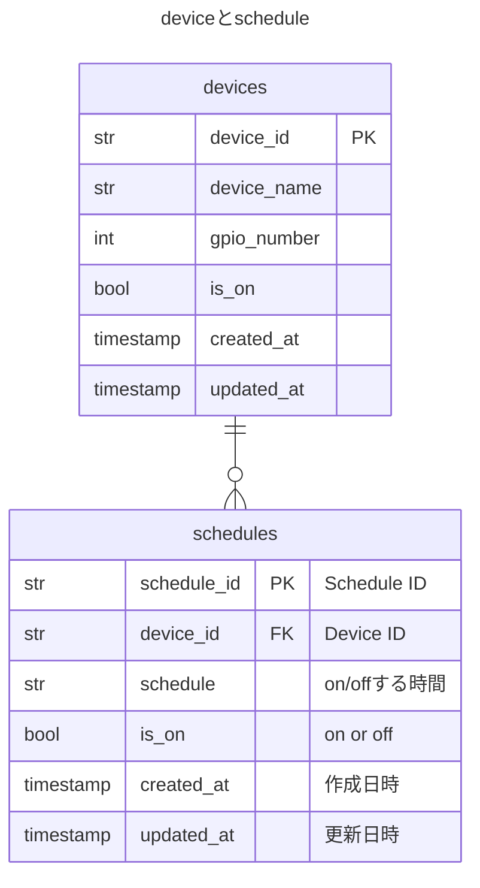

## 概要
スケジュールを設定できるAPIを実装する。
ユーザーはCRUD APIでスケジュールの設定ができる。
設定されたスケジュールに従い、Deviceを制御する実装は別タスクとし、本タスクでは取り扱わない。　

## 機能
- ユーザーはDeviceのOnOffをスケジュール設定できる
- 作成したスケジュールは削除できる
- スケジュールを取得できる
- 1つのDeviceに複数のスケジュールを設定できる
  - 例) AM10:00 On, PM18.00 Off
- スケジュールは1日の中の何時何分を示す。秒は不要。
- スケジュールは24H表記とする
    - 例)10:00, 18:00

## APIエンドポイント
- POST /schedule/{device_id}
  - Deviceのスケジュールを新規作成する
  - 存在しないdevice_idに対するスケジュール作成はbad requestとする
  - スケジュールの重複
    - 同じデバイスに対して、同じ時間に複数のスケジュールを設定可能とする。例：10:00にON、10:00にOFFのような矛盾する設定も可能とする。
  - Request bodyはschedule、is_on

- GET /schedule/{device_id}
  - device_idに紐づくスケジュールを全て取得する
  - スケジュールの配列を返す
  - 並びはスケジュール時間で昇順とする
  - 存在しないdevice_idに対するスケジュール取得はNOT FOUNDとする
  - Responseはschedule_id、schedule、is_onとする
- DELETE /schedule/{schedule_id}
  - スケジュールを削除する
  - 成功した場合status code 204を返す
  - 存在しないschedule_idに対する削除要求は404 NOT FOUND

## データ構造

## エラーハンドリング
- 時間形式のバリデーション
  - 00:00〜23:59であることを検証する。これに当てはまらない場合、bad requestとする

## 制約
- migrationの考慮は不要
- アプリケーション起動時にテーブルが作成される仕組みがありますが、schedulesテーブルも同様でよい
- alembicは利用しない
